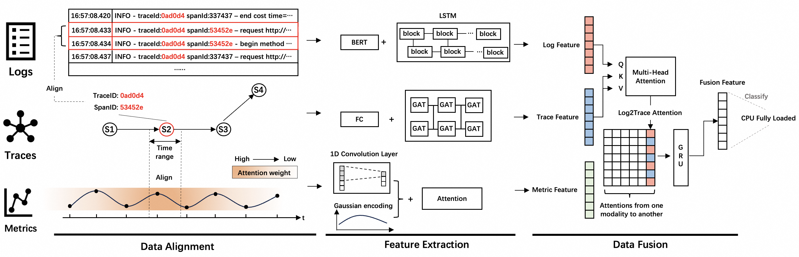

# FAMOS
FAMOS is a fault diagnosis approach for microservice systems on multi-modal Data
## overview

Existing methods struggle to address the two challenges in multi-modal fault diagnosis: First, how to avoid information loss within each modality during the data fusion process? Second, how to accurately correlate data from different modalities and mine the relationships between them? We propose that due to the significant structure differences among the three modalities of data, a late-fusion-based approach can avoid the intrinsic information loss to each modality. However, it is crucial to consider the relationships between modalities during data processing and fusion. In this paper, we propose FAMOS, a novel fault diagnosis approach for microservices on muti-modal data. For the first challenge, FAMOS employs a late-fusion-based approach and designing specific feature extractors tailored to the structures of each modality, thereby preserving the intrinsic information of each modality. To address the second challenge, we introduce a new Gaussian-attention mechanism, which assigns weights based on the degree of relationships between modalities during data processing.

## Start
To begin FAMOS on Train-ticket dataset, run this code:
```shell
python main.py --config train-ticket.yaml
```

### Requirements
```text
dgl==0.9.1
diskcache==5.6.3
einops==0.8.0
numpy==2.0.1
pandas==2.2.2
pytz==2024.1
PyYAML==6.0.1
PyYAML==6.0.1
scikit_learn==1.4.2
torch==2.3.0
torch_geometric==2.5.3
tqdm==4.66.2
```

### Dataset
publicly available at [dcm552/FAMOS-dataset](https://modelscope.cn/datasets/dcm552/FAMOS-dataset/)


### config
Our configuration files are located in the ./config directory, and you can modify the contents there to perform experiments with different datasets and parameters.
